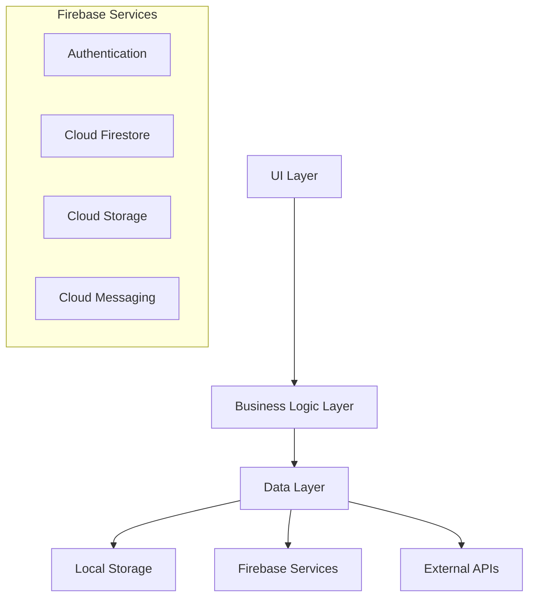
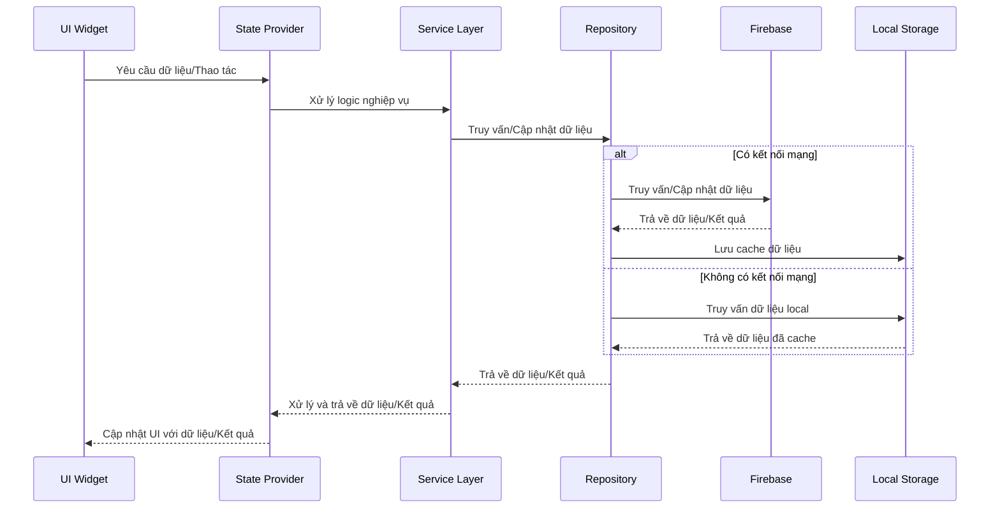
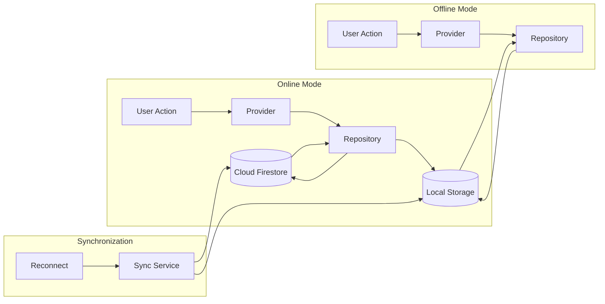

# Kiến trúc hệ thống SmartFengShui

## Kiến trúc tổng thể

SmartFengShui sử dụng kiến trúc phân lớp tuân theo các nguyên tắc thiết kế Flutter, với sự tách biệt rõ ràng giữa giao diện người dùng, logic nghiệp vụ và quản lý dữ liệu. Hệ thống được mở rộng với Firebase làm backend và các dịch vụ API.



## Các lớp trong hệ thống

### 1. UI Layer (Presentation)
- **Screens**: Các màn hình chính của ứng dụng (auth, home, calendar, chat, etc.)
- **Widgets**: Các thành phần UI có thể tái sử dụng
- **Theme**: Định nghĩa màu sắc (dark mode), font chữ và các style chung
- **Routes**: Quản lý điều hướng và luồng màn hình

### 2. Business Logic Layer
- **Models**: Các lớp đại diện cho dữ liệu nghiệp vụ (User, DayInfo, Course, ChatMessage, etc.)
- **Providers**: Quản lý state và logic nghiệp vụ
- **Services**: Các dịch vụ nghiệp vụ xử lý logic phức tạp (ChatService, ImageGenerationService)
- **Utils**: Các tiện ích và helper (DateUtils, Validators)

### 3. Data Layer
- **Repositories**: Trung gian giữa Business Logic và nguồn dữ liệu
- **Data Sources**: 
  - **Firebase**: Authentication, Firestore, Storage, Cloud Messaging
  - **Local Storage**: SharedPreferences, SQLite/Hive
  - **External APIs**: Python API cho Chatbot và Sinh ảnh

## Mẫu thiết kế áp dụng

### Provider Pattern
- Được sử dụng để quản lý state trong ứng dụng
- Cho phép chia sẻ dữ liệu giữa các widget
- Đơn giản và dễ hiểu, phù hợp với quy mô dự án

```dart
// Ví dụ Provider với Firebase tích hợp
class AuthProvider with ChangeNotifier {
  final FirebaseAuth _auth = FirebaseAuth.instance;
  User? _user;
  
  User? get user => _user;
  bool get isAuthenticated => _user != null;
  
  AuthProvider() {
    // Lắng nghe sự thay đổi trạng thái xác thực
    _auth.authStateChanges().listen((User? user) {
      _user = user;
      notifyListeners();
    });
  }
  
  Future<void> signIn(String email, String password) async {
    try {
      await _auth.signInWithEmailAndPassword(email: email, password: password);
    } catch (e) {
      throw e;
    }
  }
  
  Future<void> signOut() async {
    await _auth.signOut();
  }
}
```

### Repository Pattern
- Tạo lớp trung gian giữa nguồn dữ liệu và business logic
- Cho phép dễ dàng thay đổi nguồn dữ liệu (Firebase, mock data, API)
- Cung cấp interface nhất quán cho business logic

```dart
// Ví dụ Repository với Firebase
class UserRepository {
  final FirebaseFirestore _firestore = FirebaseFirestore.instance;
  final SharedPreferences _prefs;
  
  UserRepository(this._prefs);
  
  Future<UserModel?> getUser(String userId) async {
    try {
      // Thử lấy từ cache local
      final cachedData = _prefs.getString('user_$userId');
      if (cachedData != null) {
        return UserModel.fromJson(jsonDecode(cachedData));
      }
      
      // Nếu không có cache, lấy từ Firestore
      final doc = await _firestore.collection('users').doc(userId).get();
      if (doc.exists) {
        final user = UserModel.fromMap(doc.data()!);
        
        // Cache lại kết quả
        await _prefs.setString('user_$userId', jsonEncode(user.toMap()));
        
        return user;
      }
      return null;
    } catch (e) {
      print('Error getting user: $e');
      return null;
    }
  }
  
  Future<void> updateUser(String userId, UserModel user) async {
    await _firestore.collection('users').doc(userId).set(user.toMap());
    await _prefs.setString('user_$userId', jsonEncode(user.toMap()));
  }
}
```

### Service Pattern
- Cung cấp các dịch vụ xử lý logic nghiệp vụ phức tạp
- Tách biệt logic nghiệp vụ khỏi UI và dữ liệu
- Cho phép tái sử dụng logic giữa các provider

```dart
// Ví dụ Service cho Chatbot
class ChatService {
  final ChatRepository _repository;
  
  ChatService(this._repository);
  
  Future<ChatMessage> sendMessage(String userId, String message) async {
    // Lưu tin nhắn người dùng
    final userMessage = ChatMessage(
      id: DateTime.now().millisecondsSinceEpoch.toString(),
      content: message,
      isBot: false,
      timestamp: DateTime.now(),
    );
    
    await _repository.saveMessage(userId, userMessage);
    
    try {
      // Trong phiên bản thực tế: gọi API chatbot
      // Hiện tại: sử dụng mock data
      final botResponse = await _mockChatbotResponse(message);
      
      // Lưu tin nhắn bot
      await _repository.saveMessage(userId, botResponse);
      
      return botResponse;
    } catch (e) {
      // Xử lý lỗi và trả về tin nhắn lỗi
      final errorMessage = ChatMessage(
        id: DateTime.now().millisecondsSinceEpoch.toString(),
        content: 'Xin lỗi, có lỗi xảy ra. Vui lòng thử lại sau.',
        isBot: true,
        timestamp: DateTime.now(),
        error: true,
      );
      
      await _repository.saveMessage(userId, errorMessage);
      return errorMessage;
    }
  }
  
  // Mock API response trong giai đoạn phát triển
  Future<ChatMessage> _mockChatbotResponse(String message) async {
    // Giả lập độ trễ API
    await Future.delayed(const Duration(seconds: 1));
    
    // Các câu trả lời mẫu dựa trên từ khóa
    String response = '';
    
    if (message.toLowerCase().contains('xin chào')) {
      response = 'Xin chào! Tôi là chatbot phong thủy. Bạn cần tư vấn gì về phong thủy?';
    } else if (message.toLowerCase().contains('phong thủy')) {
      response = 'Phong thủy là học thuyết nghiên cứu về sự hài hòa giữa con người và môi trường sống. Bạn quan tâm đến phong thủy nhà ở, văn phòng hay phong thủy cá nhân?';
    } else {
      response = 'Tôi hiểu rồi. Bạn có thể cho tôi biết thêm chi tiết để tôi tư vấn phong thủy chính xác hơn không?';
    }
    
    return ChatMessage(
      id: DateTime.now().millisecondsSinceEpoch.toString(),
      content: response,
      isBot: true,
      timestamp: DateTime.now(),
    );
  }
}
```

## Luồng dữ liệu với Firebase tích hợp



## Mô hình đồng bộ dữ liệu



## Các quyết định thiết kế chính

1. **Sử dụng Firebase**: Áp dụng Firebase làm backend chính để hỗ trợ xác thực, lưu trữ dữ liệu và notification

2. **Kết hợp local storage và cloud storage**: Sử dụng SharedPreferences và Firestore để đảm bảo ứng dụng hoạt động cả online và offline

3. **Mock API**: Sử dụng mock data để mô phỏng API chatbot và sinh ảnh trong giai đoạn phát triển

4. **Dark theme**: Ưu tiên giao diện tối để tạo trải nghiệm người dùng hiện đại

5. **Modular architecture**: Tổ chức code theo module chức năng để dễ dàng mở rộng và bảo trì

6. **Bottom navigation**: Sử dụng bottom navigation bar với 5 tab chính để điều hướng chức năng

7. **Phân tách dịch vụ**: Tách biệt xử lý logic phức tạp vào các service riêng biệt để code gọn gàng và dễ test

8. **Lazy loading**: Áp dụng tải dữ liệu theo nhu cầu để giảm tải trọng mạng và cải thiện hiệu suất

9. **Caching strategy**: Ưu tiên dữ liệu local trước, sau đó đồng bộ với cloud để tạo trải nghiệm nhanh và mượt mà
