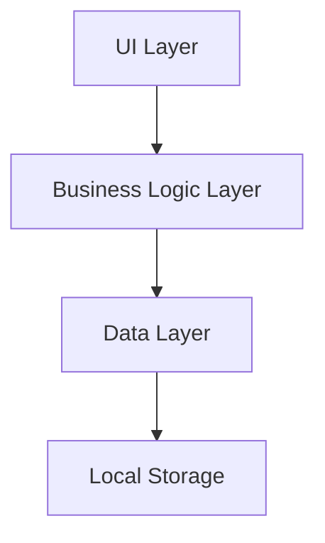
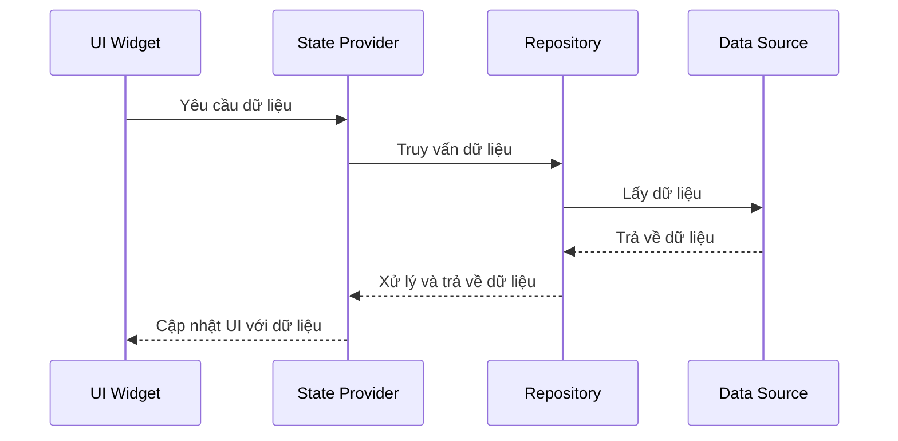

# Kiến trúc hệ thống SmartFengShui

## Kiến trúc tổng thể

SmartFengShui sử dụng kiến trúc phân lớp cơ bản tuân theo các nguyên tắc thiết kế Flutter, với sự tách biệt rõ ràng giữa giao diện người dùng, logic nghiệp vụ và quản lý dữ liệu.



## Các lớp trong hệ thống

### 1. UI Layer (Presentation)
- **Screens**: Các màn hình chính của ứng dụng
- **Widgets**: Các thành phần UI có thể tái sử dụng
- **Theme**: Định nghĩa màu sắc, font chữ và các style chung

### 2. Business Logic Layer
- **Models**: Các lớp đại diện cho dữ liệu nghiệp vụ
- **Providers**: Quản lý state và logic nghiệp vụ

### 3. Data Layer
- **Repositories**: Trung gian giữa Business Logic và nguồn dữ liệu
- **Data Sources**: Nguồn dữ liệu (local data, API services)

## Mẫu thiết kế áp dụng

### Provider Pattern
- Được sử dụng để quản lý state trong ứng dụng
- Cho phép chia sẻ dữ liệu giữa các widget
- Đơn giản và dễ hiểu, phù hợp với quy mô dự án

```dart
// Ví dụ Provider
class CalendarProvider with ChangeNotifier {
  Map<DateTime, DayInfo> _dayInfos = {};
  
  Map<DateTime, DayInfo> get dayInfos => _dayInfos;
  
  DayInfo? getDayInfo(DateTime date) {
    return _dayInfos[date];
  }
  
  void loadDayInfos() {
    // Load từ dữ liệu mẫu
    _dayInfos = sampleDayInfos;
    notifyListeners();
  }
}
```

### Repository Pattern
- Tạo lớp trung gian giữa nguồn dữ liệu và business logic
- Cho phép dễ dàng thay đổi nguồn dữ liệu sau này (từ dữ liệu mẫu sang API)

```dart
// Ví dụ Repository
class CourseRepository {
  List<Course> getCourses() {
    // Hiện tại lấy từ dữ liệu mẫu, sau này có thể thay đổi sang API
    return sampleCourses;
  }
  
  Course? getCourseById(String id) {
    return sampleCourses.firstWhere((course) => course.id == id);
  }
}
```

## Luồng dữ liệu



## Các quyết định thiết kế chính

1. **Không sử dụng state management phức tạp**: Chọn Provider thay vì BLoC/Redux để đơn giản hóa việc phát triển cho người mới

2. **Dữ liệu mẫu tĩnh**: Sử dụng dữ liệu mẫu tĩnh thay vì API để đơn giản hóa việc phát triển ban đầu và không phụ thuộc vào backend

3. **Shared Preferences cho lưu trữ**: Sử dụng SharedPreferences cho lưu trữ nhỏ, đơn giản như cài đặt người dùng

4. **Phân chia widget**: Tạo các widget có thể tái sử dụng để giữ cho code sạch và dễ bảo trì

5. **Routing đơn giản**: Sử dụng Navigator 1.0 để điều hướng đơn giản giữa các màn hình
